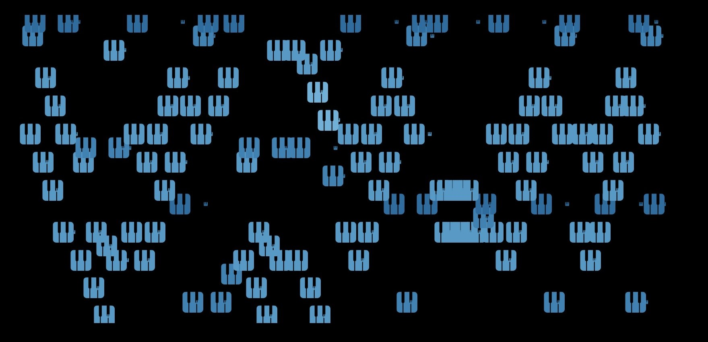

# Seeing Sound

Where this all started. In 2024, I wanted to know what music looked like as data, so I parsed MIDI files from Parker, Zeppelin, Queen, and Gershwin into CSVs and built visualizations in Tableau and Excel. Rough, curious, academic.

The questions it raised (how do you represent sound? what makes a genre recognizable?) sent me toward PyTorch, PANNs, and MERT.

## What's in here

Two parallel experiments, both trying to make music visible.

**Polar mapping.** Using `music21` to parse MIDI, then mapping note onset to angle and pitch to radius. Every note becomes an (x, y) coordinate on a circle. Feed that into Tableau and you get a piano roll wrapped into a ring. The `.trex` files in `visualizations/tableau/` are the extensions that made this work. I didn't know I was building a 2D embedding by hand. I just thought it looked cool.



**Statistical views.** Using `mido` to walk MIDI messages and pull out pitch, velocity, duration, and timing. From there: piano rolls, density heatmaps, 3D scatters by note and velocity, octave histograms, normalized frequency maps. `src/final_analysis.py` produces seven different views of a single file. Some are more legible than others. That was the point.


## The pieces

- Charlie Parker, *Donna Lee*
- Thelonious Monk, *Blue Monk*
- Led Zeppelin, *I Can't Quit You Baby*
- Queen, *Bohemian Rhapsody* and *Killer Queen*
- Gershwin, *Rhapsody in Blue*

Jazz, rock, and classical, on purpose. I wanted the contrast.

## How to run it

```bash
